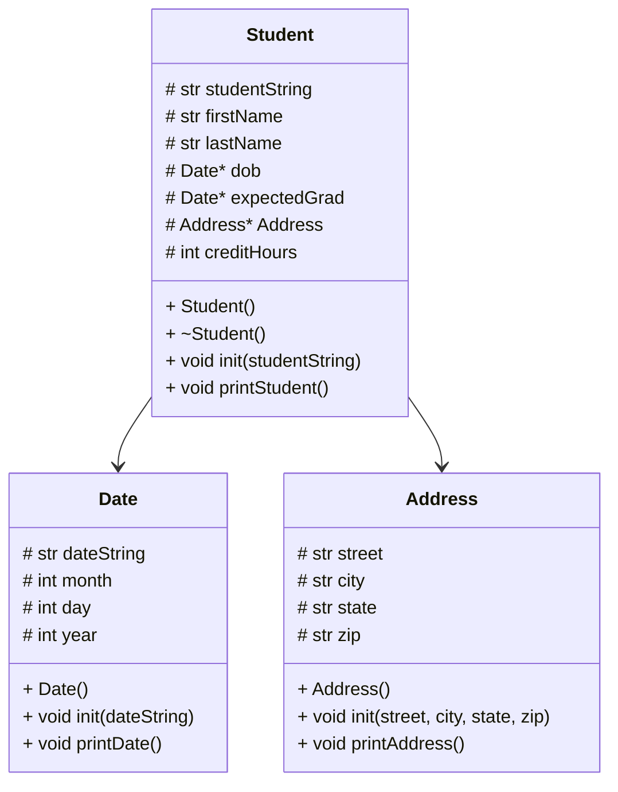

# Address Header
```
If not defined, define the header of Address

class Address{
protected:
  define street, city, state, and zip as strings

public:
  create constructor for Address class
  create an initializer that receives 4 string inputs: street, city, state, and zip
  create printAddress function for Address class

```
# Address Code
```
in


  
  


```
