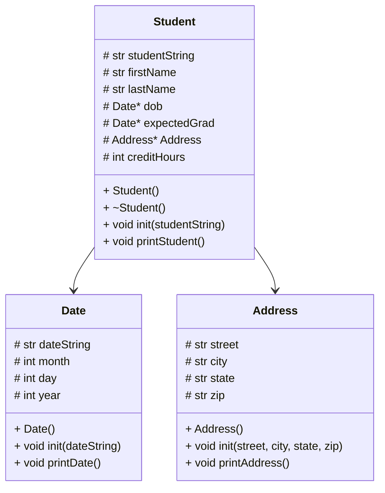

# Address Header
```
if not defined, define header of Address

class Address{
protected:
  define street, city, state, and zip as strings

public:
  create constructor for Address class / Address()
  create an initializer / init that receives 4 string inputs: street, city, state, and zip
  create printAddress function for Address class

};

#endif
```
# Address Code
``` 
include header

Address::init(street, city, state, and zip as strings){
  assign str 'street' to 'street' in Address class
  assign str 'city' to 'city' in Address class
  assign str 'state' to 'state' in Address class
  assign str 'zip' to 'zip' in Address class
}

printAddress(){
  print full address (street, city, state, zip) in correct format
  endl
}
```
# Date Header
```
if not defined, define header of Date

class Date{
protected:
  store full date into string / dateString
  define each piece of the date:
  define month as integer
  define day as integer
  define year as integer

public:
  create constructor for Date class / Date()
  create an initializer / init that recieves dateString
  create printDate() function
};

#endif
```
# Date Code
```
Date::init(dateString){
  create string stream for dateString
  define each piece of dateString as string:
  define month piece as monthString
  define day piece as dayString
  define year piece as yearString

 use getline + string steam + '/' delimiter to separate pieces
 read dateString up to first '/' to get month
 read dateString up to next '/' to get day
 read rest of dateString to get year

 convert monthString to integer
 convert dayString to integer
 convert yearString to integer

}

Date::printDate(){
  create a string array of months[]{
  index 0 is blank
  index 1 is January
  index 2 is February
  ...
  index 12 is December
  }

  print month[index] day, and year in correct format
  endl

}

```
 
